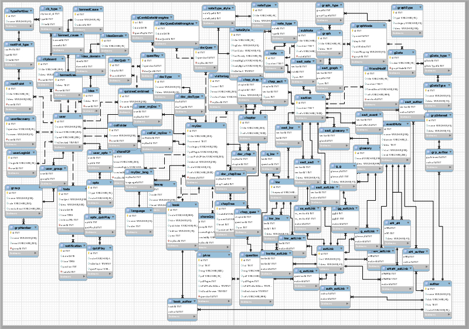
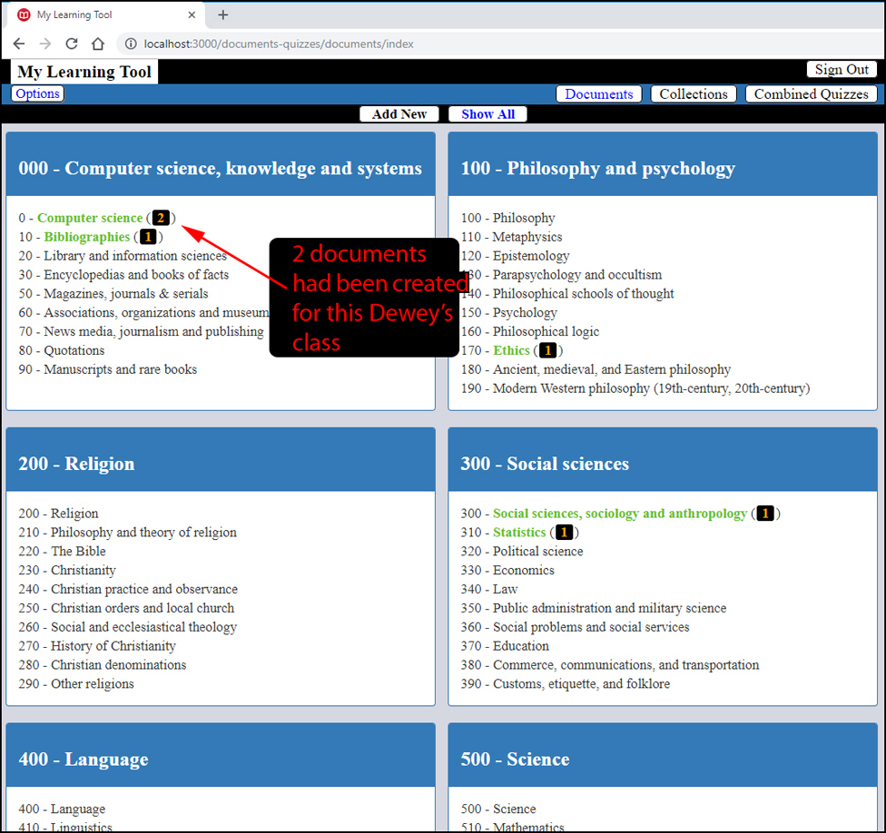
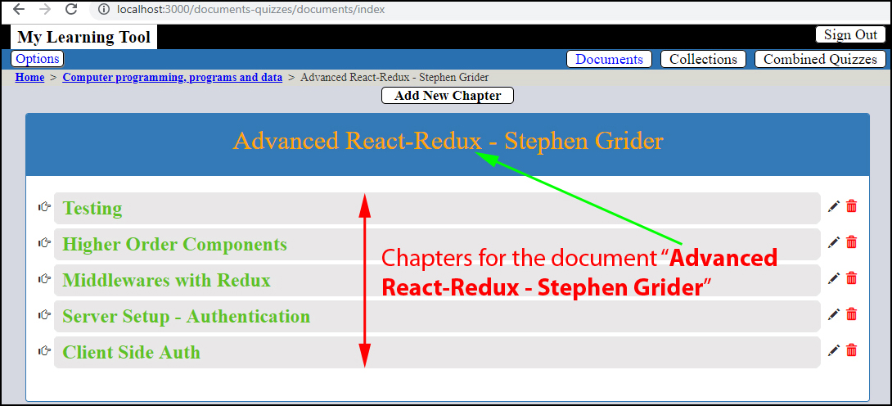
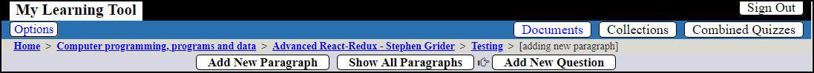

# Document's Summaries & Quizzes Using Dewey Decimal System

## Aim
> * To build a system which allows us to make summaries of a documents (**courses**, **books**, etc.) and to build **quizzes** for each chapter.
> * We should be able to build a main **quiz** (grouping quizzes from chapters).
> * We should be able to put together several **quizzes** from different documents (excellent for everyone to train for an exam).
> * The system is built to form a kind of knowledge's network, without any centralized point. There are several ways to connect subjects (courses, etc.) together:
>     - By **keyword**
>     - By **event**
>     - By **author**
>     - etc. 

---

## Who Could Be Insterested on Using This Project?

* Any individual wishing to **build**, **organize** (**classify**) his (her) documents in a system which could be use for years (SQL) with a total control of the whole system (3-tier).
* Could be used by a small organization (with a little more tables to manage the "**authoriration**") by putting the ***server*** and the ***database*** on a **cloud** (**AWS**, for example). Everything is ready - from the conception - for the deployment on **clouds** (**server** and **database** could be on two different systems without problem).
* A school or a teacher: the tests (**quizzes**) could be recorded on the database with all results of every question. So, he (she) could make survey of progression of students (and giving grades)

---

## What Architecture?
A **3-tier architecture** with **authentication** (**JWT** + **Passport**) is used. The general tools are:

> ### Authentication
>   * **JWT**
>   * **Passport** (for its **strategies**)
>
> ### Front-End
> * **React-Redux**
>
> ### Back-end
> * **Express/NodeJS** and **Sequelize**  is used as **ORM**
>
> ### Database
>
> A **Relational Database** is needed, and MySQL was chosen. For now, the project has **74 tables**, well-normalized (this ERR was created using **MySql WorkBench** to give us a global view and also the relationship between tables). Almost all fields are deleted because they are going to be created with ***Sequelize*** which has different ways of declaring fields (for example, "**String**" - 256 characters - instead of "**varchar**"). All **ALL** of ***id*** are **UUIDv4** instead of **int**, etc. "**Transaction**" and "**cascade**" deleting are used to deal correctly with data in **CRUD** (**C**reate, **R**ead, **U**pdate and **D**elete operations).:

---

## What are advantages of this architecture?
This is a **3-tier architecture**, each "***tier***" is independent from the others from the conception of the project. We could deploy any of them on a distance machine, they will work together right the way (after configuration for the connection).

**React-Redux** allows us to deal easily with complex forms (for this app, the most complex form could have more than 20 fields). The use of "***virtual DOM***" by **React** gives us a faster speed comparing to frameworks using directly the real DOM). The best part is "**Redux**" gives us the possibilities to deal with JSON objects which is extremely easy to understand, and any component could modify - from any where - the values in the "**store**". We don't need to know - for a given component - where it is in the hierarchy of the structure. That's why, from anywhere, we could navigate to any point of the path to the **root** right the way. 

**React-Redux** offers reliability and very high speed of execution. As soon as we click on a link, the result appears instantaneously (however, with a distance **server** and a distance **database**, the latency must be much more important). But, as we make request for very few data each time, the speed should be very fast even with the most "heavy" request (with the most data transfert from the server).

---

## What Classification System to Use?

The **Dewey Decimal Classification** was chosen (this system is used  in 200,000 libraries in at least 135 countries.) The classification's notation makes use of three-digit Arabic numerals for main classes, with fractional decimals allowing expansion for further detail. Using Arabic numerals for symbols, it is flexible to the degree that numbers can be expanded in linear fashion to cover special aspects of general subjects. The Decimal Classification introduced the concepts of relative location and relative index which allow new books to be added to a library in their appropriate location based on subject. An overview from the main User Interface:

---

## How it Works?

From the main **user interface**, we could add new document (by clicking on "**Add New**")

the added document will look like (we have two documents for now):

The chapters could be added by the same procedure (after a document was choosing to contain the new chapters):

As well as for the paragraphs. We could write paragraph's content using HTML's tags (which has to pass the "**sanitizing**'s" process) for the formatting. Maybe an editor could be added later...

In "**reading**" mode, only formatted text could be displayed (no more "ugly" HTML's tags).

Insertion a new question (with it proposed answers): 

### Intuitive Navigation

Links allow to reach a given point right the way:
 

---

## What Kind of Quizzes Could We Have?
There are several type of "quiz":
   - **Memorization** (no proposed answer)
   - **Flashcard** (one proposed answer)
   - **MCQ** (2 or more proposed answers)

---

## Author
* Dinh HUYNH - All Rights Reserved!
* dinh.hu19@yahoo.com