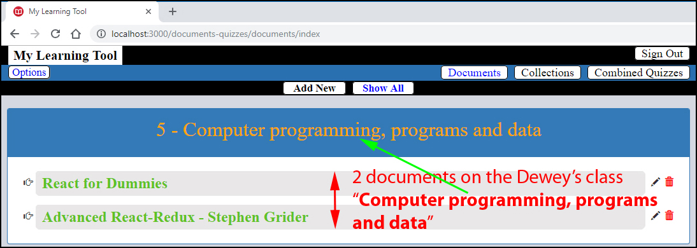
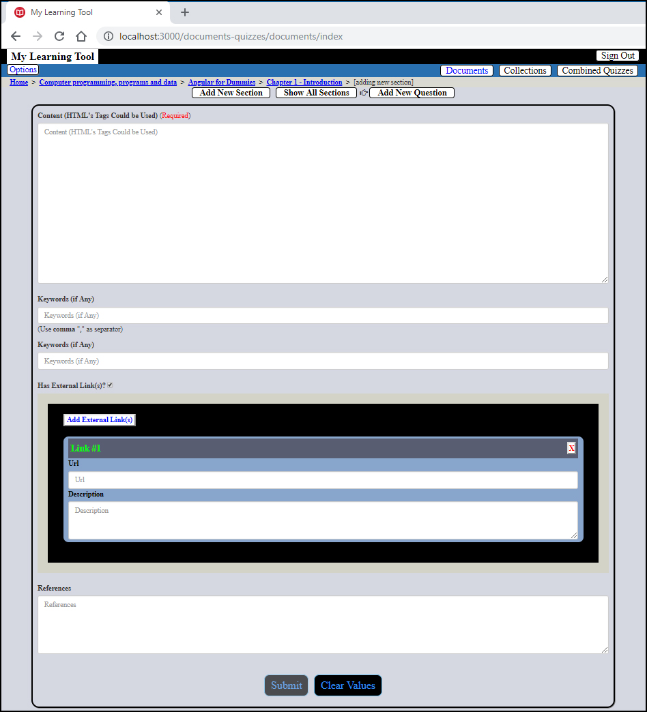

# Document's Summaries & Quizzes Using Dewey Decimal System
---

## Aim
> * To build a system which allows us to make summaries of a documents (**courses**, **books**, etc.) and to build **quizzes** for each chapter.
> * We should be able to build a main **quiz** (grouping quizzes from chapters).
> * We should be able to put together several **quizzes** from different documents (excellent for everyone to train for an exam).
> * The system is built to form a kind of knowledge's network, without any centralized point. There are several ways to connect subjects (courses, etc.) together:
>     - By **keyword**
>     - By **event**
>     - By **author**
>     - etc. 

## What Classification System to Use?

The **Dewey Decimal Classification** was chosen (this system is used  in 200,000 libraries in at least 135 countries.) The classification's notation makes use of three-digit Arabic numerals for main classes, with fractional decimals allowing expansion for further detail. Using Arabic numerals for symbols, it is flexible to the degree that numbers can be expanded in linear fashion to cover special aspects of general subjects. The Decimal Classification introduced the concepts of relative location and relative index which allow new books to be added to a library in their appropriate location based on subject. An overview from this app:

## What are the Tools to Use?

### Authentication
   * **JWT**
   * **Passport** (for its **strategies**)

### Front-End
* **React-Redux** architecture.

### Back-end
* **Express/NodeJS**

### Database

* A **Relational Database** is needed, and MySQL was chosen. For now, the project has 74 tables, well-normalized (**Sequelize** is used as **ORM**):

## How it Works?

From the main **user interface**, we could add new document (by clicking on "**Add New**")

the added document will look like (we have just one document for now):

The chapters could be added by the same procedure (after a document was choosing to contain the new chapters):

As well as for the paragraphs. We could write paragraph's content using HTML's tags (which has to pass the "**sanitizing**'s" process) for the formatting. Maybe an editor could be added later...

In "**reading**" mode, only formatted text could be displayed (no more "ugly" HTML's tags).

---

## What Kind of Quizzes Could We Have?
There are several type of "quiz":
   - **Memorization** (no proposed answer)
   - **Flashcard** (one proposed answer)
   - **MCQ** (2 or more proposed answers)

---------------

## Author
* Dinh HUYNH - All Rights Reserved!
* dinh.hu19@yahoo.com